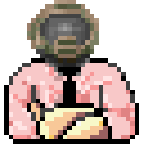

# The Vanilla Utilities

This is a collection of DOS utilities for interacting with Doom's external
driver APIs. Specifically it includes improved versions of Doom's network
drivers (IPXSETUP and SERSETUP) along with APIs for the
[network](https://doomwiki.org/wiki/Doom_networking_component#External_drivers),
[control](https://doomwiki.org/wiki/External_control_driver), and
[statistics](https://doomwiki.org/wiki/Statistics_driver) interfaces.

Design principles here are:

* **Composability** - it is possible to combine multiple tools and use them
together.
* **Reusability** - the codebase has clearly-defined APIs for interacting
with Doom's command line interfaces, so that making new tools is
straightforward.

## Utilities

* **udpsetup** - network driver for Internet play over the UDP protocol.
Multiple network stacks are supported including Winsock1, Winsock2 and the
DOS MSClient stack. The protocol is the same as DOSbox's IPXNET protocol,
so it can connect to DOSbox servers and play against emulated machines.
[Example video](https://www.youtube.com/watch?v=1PLXPSP7ZBE).
* **ipxsetup** - bugfixed and expanded version of the driver originally shipped
with Doom. Supports the extensions from [xttl's version](https://github.com/AXDOOMER/ipxsetup_xttl)
with further enhancements (not all players need specify the -dup or -player
parameters).
* **sersetup** - bugfixed and expanded version of the serial/modem driver
originally included with Doom. Supports background answering, which allows the
game to launch before the incoming call is received.
* **parsetup** - parallel port network driver, derived from
[the version from the idgames archive](https://www.doomworld.com/idgames/utils/serial/psetup11).
Performance has been significantly improved.
* **sirsetup** - driver for running over a half-duplex serial infrared (SIR)
link (aka IrDA), as commonly found on many late '90s laptops.
* **metanet** - networking driver that combines other networking drivers
into a packet forwarding network. This allows you, for example, to build a
a four player game from daisy-chaining null-modem cables.
See [METANET-HOWTO](METANET-HOWTO.md) for more information.
* **solo-net** - null/standalone network driver that starts a network game
without any real connection. Replicates the `-solo-net` parameter found in
many Doom source ports.
* **analogjs** - PC joystick driver with analog control that is more precise
than Doom's built in joystick support.
* **replay** - demo replay tool that uses the external control API, so that
demos can be "continued" by recording a new demo from an old one.
* **statdump** - external statistics driver that can write a text summary.
* **vcommit** - adapter that converts a Doom network driver into a 3D Realms
*COMMIT* driver, as used for *Duke Nukem 3D*, *Blood*, *Shadow Warrior*
and various other games. This means that all of the above network drivers
can also be used with those games.
[Example video](https://youtu.be/4L5wVLp5wVE).
* **vrottcom** - adapter that converts a Doom network driver into a *Rise
of the Triad* ROTTCOM driver. This means that all of the above network
drivers can also be used with ROTT.
